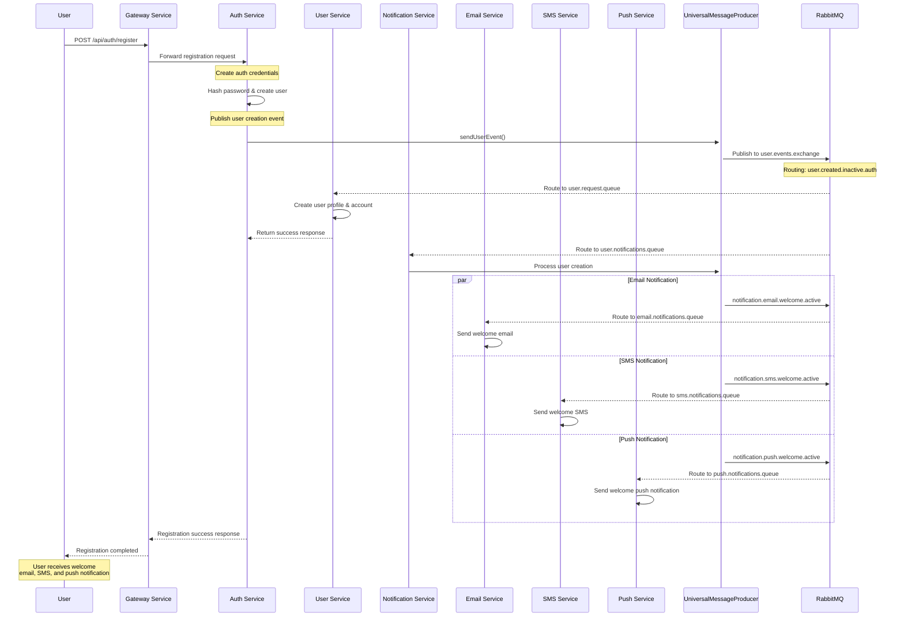
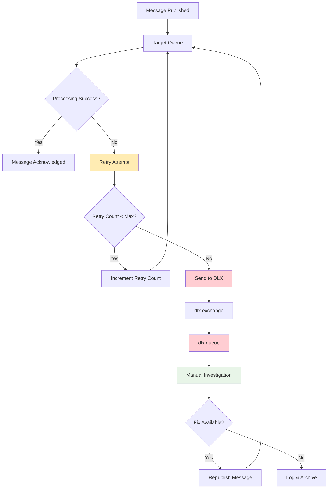
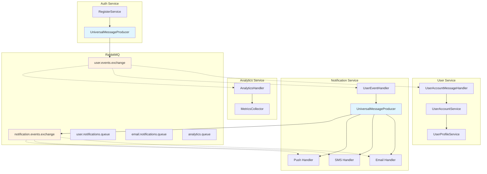

# 📚 Common Messaging Library v1.2.0 - Complete Documentation

## 🎯 **Overview**

The **Common Messaging Library v1.2.0** provides a comprehensive, standardized messaging infrastructure for the YaniQ microservices ecosystem. This library enables seamless inter-service communication with maximum reusability, consistent routing patterns, and robust error handling.

---

## 📦 **Library Information**

### **Maven Coordinates**
```xml
<dependency>
    <groupId>com.yaniq</groupId>
    <artifactId>common-messaging</artifactId>
    <version>1.2.0</version>
</dependency>
```

### **Key Packages & Classes**
```
com.yaniq.common_messaging
├── config/
│   ├── MessagingConstants.java           # All messaging constants
│   ├── RabbitMQConfig.java              # RabbitMQ utilities
│   └── UniversalMessagingConfig.java    # Main configuration
├── producer/
│   └── UniversalMessageProducer.java    # Message publishing
├── routing/
│   └── RoutingKeyBuilder.java           # Routing utilities
├── types/
│   ├── MessageType.java                 # 67 message types
│   ├── RequestType.java                 # 46 request types
│   ├── MessagePriority.java             # 5 priority levels
│   └── MessageStatus.java               # Message statuses
├── messages/
│   ├── BaseMessage.java                 # Message interface
│   └── StandardMessage.java             # Standard implementation
├── requests/
│   └── BaseRequest.java                 # Request wrapper
├── responses/
│   └── BaseResponse.java                # Response wrapper
└── payloads/
    ├── UserEventPayload.java            # User events
    ├── NotificationPayload.java         # Notifications
    ├── OrderEventPayload.java           # Order events
    └── PaymentEventPayload.java         # Payment events
```

---

## 🔧 **Quick Start Guide**

### **1. Add Dependency**
```xml
<dependencies>
    <dependency>
        <groupId>com.yaniq</groupId>
        <artifactId>common-messaging</artifactId>
        <version>1.2.0</version>
    </dependency>
</dependencies>
```

### **2. Create Configuration Class**
```java
package com.example.service.config;

import com.yaniq.common_messaging.config.UniversalMessagingConfig;
import com.yaniq.common_messaging.producer.UniversalMessageProducer;
import org.springframework.amqp.rabbit.core.RabbitTemplate;
import org.springframework.context.annotation.Bean;
import org.springframework.context.annotation.Configuration;
import org.springframework.context.annotation.Import;

@Configuration
@Import({
    UniversalMessagingConfig.class    // Imports all messaging infrastructure
})
public class MessagingConfig {
    
    @Bean
    public UniversalMessageProducer universalMessageProducer(RabbitTemplate rabbitTemplate) {
        return new UniversalMessageProducer(rabbitTemplate);
    }
}
```

### **3. Publish Messages**
```java
@Service
@RequiredArgsConstructor
public class MyService {
    private final UniversalMessageProducer messageProducer;
    
    public void publishUserEvent(UserData user) {
        UserEventPayload payload = UserEventPayload.builder()
            .userId(user.getId())
            .eventType(UserEventType.CREATED)
            .status(UserStatus.INACTIVE)
            .email(user.getEmail())
            .build();
            
        messageProducer.sendUserEvent("created", "inactive", "my-service", payload);
    }
}
```

### **4. Consume Messages**
```java
@Component
public class MyEventHandler {
    
    @RabbitListener(queues = MessagingConstants.USER_NOTIFICATIONS_QUEUE)
    public void handleUserEvent(UserEventPayload payload, Message message) {
        String routingKey = message.getMessageProperties().getReceivedRoutingKey();
        // Process the event
    }
}
```

---

## 🏗️ **Architecture Overview**

```mermaid
graph TB
    subgraph "Service A (Publisher)"
        A1[Service Layer] --> A2[UniversalMessageProducer]
        A2 --> A3[RabbitTemplate]
    end
    
    subgraph "RabbitMQ Infrastructure"
        B1[Topic Exchange<br/>user.events.exchange]
        B2[Queue<br/>user.notifications.queue]
        B3[Topic Exchange<br/>notification.events.exchange]
        B4[Email Queue<br/>email.notifications.queue]
        B5[SMS Queue<br/>sms.notifications.queue]
        B6[Push Queue<br/>push.notifications.queue]
        B7[DLX Exchange<br/>dlx.exchange]
        B8[DLX Queue<br/>dlx.queue]
    end
    
    subgraph "Service B (Consumer)"
        C1[@RabbitListener] --> C2[UserEventHandler]
        C2 --> C3[UniversalMessageProducer]
        C3 --> C4[Notification Handlers]
    end
    
    A3 --> B1
    B1 -.->|user.created.*.*| B2
    B2 --> C1
    C3 --> B3
    B3 -.->|notification.email.*| B4
    B3 -.->|notification.sms.*| B5
    B3 -.->|notification.push.*| B6
    B1 -.->|Failed Messages| B7
    B7 --> B8
    
    style A2 fill:#e1f5fe
    style C2 fill:#f3e5f5
    style B1 fill:#fff3e0
    style B3 fill:#fff3e0
```

---

## 📋 **Constants & Configuration**

### **Exchange Constants**
```java
// Event Exchanges (TopicExchange)
MessagingConstants.USER_EVENTS_EXCHANGE          = "user.events.exchange"
MessagingConstants.ORDER_EVENTS_EXCHANGE         = "order.events.exchange"
MessagingConstants.PAYMENT_EVENTS_EXCHANGE       = "payment.events.exchange"
MessagingConstants.NOTIFICATION_EVENTS_EXCHANGE  = "notification.events.exchange"
MessagingConstants.ANALYTICS_EVENTS_EXCHANGE     = "analytics.events.exchange"
MessagingConstants.SYSTEM_EVENTS_EXCHANGE        = "system.events.exchange"

// Request/Response Exchanges (DirectExchange)
MessagingConstants.USER_REQUEST_EXCHANGE         = "user.requests.exchange"
MessagingConstants.ORDER_REQUEST_EXCHANGE        = "order.requests.exchange"
MessagingConstants.AUTH_REQUEST_EXCHANGE         = "auth.requests.exchange"

// Dead Letter Exchange
MessagingConstants.DLX_EXCHANGE                  = "dlx.exchange"
```

### **Queue Constants**
```java
// User Domain Queues
MessagingConstants.USER_NOTIFICATIONS_QUEUE     = "user.notifications.queue"
MessagingConstants.USER_ANALYTICS_QUEUE         = "user.analytics.queue"

// Notification Queues
MessagingConstants.EMAIL_NOTIFICATIONS_QUEUE    = "email.notifications.queue"
MessagingConstants.SMS_NOTIFICATIONS_QUEUE      = "sms.notifications.queue"
MessagingConstants.PUSH_NOTIFICATIONS_QUEUE     = "push.notifications.queue"
MessagingConstants.WEBHOOK_NOTIFICATIONS_QUEUE  = "webhook.notifications.queue"

// Auth Domain Queues
MessagingConstants.AUTH_ANALYTICS_QUEUE         = "auth.analytics.queue"
MessagingConstants.AUTH_SECURITY_QUEUE          = "auth.security.queue"

// System Queues
MessagingConstants.DLX_QUEUE                    = "dlx.queue"
```

### **Routing Key Patterns**
```java
// User Event Patterns
MessagingConstants.USER_CREATED_PATTERN         = "user.created.*.*"
MessagingConstants.USER_ACTIVATED_PATTERN       = "user.activated.*.*"
MessagingConstants.USER_DEACTIVATED_PATTERN     = "user.deactivated.*.*"
MessagingConstants.USER_ALL_PATTERN             = "user.*.*.*"

// Notification Patterns
MessagingConstants.NOTIFICATION_EMAIL_PATTERN   = "notification.email.*.*"
MessagingConstants.NOTIFICATION_SMS_PATTERN     = "notification.sms.*.*"
MessagingConstants.NOTIFICATION_PUSH_PATTERN    = "notification.push.*.*"
MessagingConstants.NOTIFICATION_ALL_PATTERN     = "notification.*.*.*"
```

### **Message TTL Configuration**
```java
MessagingConstants.DEFAULT_MESSAGE_TTL          = 300000L    // 5 minutes
MessagingConstants.NOTIFICATION_MESSAGE_TTL     = 600000L    // 10 minutes
MessagingConstants.SYSTEM_MESSAGE_TTL           = 60000L     // 1 minute
MessagingConstants.ANALYTICS_MESSAGE_TTL        = 3600000L   // 1 hour
MessagingConstants.AUDIT_MESSAGE_TTL            = 86400000L  // 24 hours
```

---

## 🎯 **User Registration Flow**

### **Complete Registration Process Diagram**



### **Registration Implementation Example**

#### **1. Auth Service - Publishing User Event**
```java
@Service
@RequiredArgsConstructor
public class RegisterService {
    private final UniversalMessageProducer messageProducer;
    
    @Transactional
    public RegisterResponse registerCustomer(CustomerRegisterRequest request) {
        // Create auth user
        User savedUser = userRepository.save(newUser);
        
        // Send to user service for profile creation
        RegisterMessageResponse userResponse = registerUserWithUserService(request, savedUser.getId());
        
        // Publish user creation event for notifications
        UserEventPayload eventPayload = UserEventPayload.builder()
            .userId(savedUser.getId())
            .authUserId(savedUser.getId())
            .eventType(UserEventType.CREATED)
            .status(UserStatus.INACTIVE)
            .email(savedUser.getEmail())
            .sourceService("auth-service")
            .build();
            
        messageProducer.sendUserEvent(
            RoutingKeyBuilder.ACTION_CREATED,
            RoutingKeyBuilder.STATUS_INACTIVE,
            RoutingKeyBuilder.SERVICE_AUTH,
            eventPayload
        );
        
        return buildSuccessResponse(savedUser, userResponse);
    }
}
```

#### **2. Notification Service - Processing User Events**
```java
@Component
@RequiredArgsConstructor
public class UserEventHandler {
    private final UniversalMessageProducer messageProducer;
    
    @RabbitListener(queues = MessagingConstants.USER_NOTIFICATIONS_QUEUE)
    public void handleUserCreatedEvent(@NotNull UserEventPayload payload, Message message) {
        String routingKey = message.getMessageProperties().getReceivedRoutingKey();
        
        if (payload.getEventType() == UserEventType.CREATED) {
            // Send welcome email
            NotificationPayload emailNotification = createEmailNotification(payload, "welcome");
            messageProducer.sendNotification("email", "welcome", "active", emailNotification);
            
            // Send welcome SMS
            NotificationPayload smsNotification = createSmsNotification(payload, "welcome");
            messageProducer.sendNotification("sms", "welcome", "active", smsNotification);
            
            // Send welcome push notification
            NotificationPayload pushNotification = createPushNotification(payload, "welcome");
            messageProducer.sendNotification("push", "welcome", "active", pushNotification);
        }
    }
}
```

#### **3. Email Notification Handler**
```java
@Component
public class EmailNotificationHandler {
    
    @RabbitListener(queues = MessagingConstants.EMAIL_NOTIFICATIONS_QUEUE)
    public void handleEmailNotification(NotificationPayload notification, Message message) {
        String routingKey = message.getMessageProperties().getReceivedRoutingKey();
        RoutingKeyBuilder.RoutingKeyComponents components = RoutingKeyBuilder.parse(routingKey);
        
        switch (components.getAction()) {
            case "welcome":
                processWelcomeEmail(notification);
                break;
            case "verification":
                processVerificationEmail(notification);
                break;
            // ... other email types
        }
    }
}
```

---

## 🔄 **Message Flow Diagrams**

### **1. Basic Event Publishing Flow**

```mermaid
flowchart TD
    A[Service Method] --> B[UniversalMessageProducer]
    B --> C{Message Type}
    
    C -->|User Event| D[sendUserEvent()]
    C -->|Notification| E[sendNotification()]
    C -->|Order Event| F[sendOrderEvent()]
    C -->|System Event| G[sendSystemEvent()]
    
    D --> H[Build Routing Key<br/>user.created.inactive.auth]
    E --> I[Build Routing Key<br/>notification.email.welcome.active]
    F --> J[Build Routing Key<br/>order.created.confirmed.order-service]
    G --> K[Build Routing Key<br/>system.health.ok.monitoring]
    
    H --> L[user.events.exchange]
    I --> M[notification.events.exchange]
    J --> N[order.events.exchange]
    K --> O[system.events.exchange]
    
    L --> P[user.notifications.queue]
    M --> Q[email.notifications.queue]
    N --> R[order.processing.queue]
    O --> S[system.monitoring.queue]
    
    style B fill:#e1f5fe
    style L fill:#fff3e0
    style M fill:#fff3e0
    style N fill:#fff3e0
    style O fill:#fff3e0
```

### **2. Error Handling & Dead Letter Flow**



### **3. Multi-Service Communication Pattern**



---

## 📊 **Message Types & Priorities**

### **Available Message Types (67 Total)**

#### **User Domain (15 types)**
```java
MessageType.USER_CREATED                 // New user registration
MessageType.USER_UPDATED                 // Profile updates
MessageType.USER_DELETED                 // Account deletion
MessageType.USER_ACTIVATED               // Account activation
MessageType.USER_DEACTIVATED             // Account deactivation
MessageType.USER_VERIFIED                // Email/phone verification
MessageType.USER_PASSWORD_CHANGED        // Password updates
MessageType.USER_EMAIL_CHANGED           // Email updates
MessageType.USER_PHONE_CHANGED           // Phone updates
MessageType.USER_PROFILE_UPDATED         // Profile modifications
MessageType.USER_PREFERENCES_UPDATED     // Preference changes
MessageType.USER_LOGIN_SUCCESS           // Successful login
MessageType.USER_LOGIN_FAILED            // Failed login attempt
MessageType.USER_LOGOUT                  // User logout
MessageType.USER_SESSION_EXPIRED         // Session expiration
```

#### **Authentication Domain (8 types)**
```java
MessageType.AUTH_LOGIN                   // Login attempt
MessageType.AUTH_LOGOUT                  // Logout
MessageType.AUTH_PASSWORD_RESET          // Password reset request
MessageType.AUTH_PASSWORD_CHANGED        // Password change
MessageType.AUTH_TOKEN_REFRESH           // Token refresh
MessageType.AUTH_VERIFICATION_SENT       // Verification email sent
MessageType.AUTH_VERIFICATION_COMPLETED  // Verification completed
MessageType.AUTH_ACCOUNT_LOCKED          // Account locked
```

#### **Order Domain (12 types)**
```java
MessageType.ORDER_CREATED                // New order
MessageType.ORDER_UPDATED                // Order modifications
MessageType.ORDER_CANCELLED              // Order cancellation
MessageType.ORDER_CONFIRMED              // Order confirmation
MessageType.ORDER_SHIPPED                // Order shipped
MessageType.ORDER_DELIVERED              // Order delivered
MessageType.ORDER_RETURNED               // Order return
MessageType.ORDER_REFUNDED               // Order refund
MessageType.ORDER_PAYMENT_PENDING        // Payment pending
MessageType.ORDER_PAYMENT_COMPLETED      // Payment completed
MessageType.ORDER_PAYMENT_FAILED         // Payment failed
MessageType.ORDER_STATUS_CHANGED         // Status update
```

#### **Notification Domain (7 types)**
```java
MessageType.NOTIFICATION_EMAIL           // Email notification
MessageType.NOTIFICATION_SMS             // SMS notification
MessageType.NOTIFICATION_PUSH            // Push notification
MessageType.NOTIFICATION_IN_APP          // In-app notification
MessageType.NOTIFICATION_WEBHOOK         // Webhook notification
MessageType.NOTIFICATION_SCHEDULED       // Scheduled notification
MessageType.NOTIFICATION_DELIVERED       // Delivery confirmation
```

### **Message Priority Levels**

```java
public enum MessagePriority {
    LOW(1),         // Analytics, reports, non-urgent notifications
    NORMAL(2),      // Standard business operations
    HIGH(3),        // User-facing operations, welcome emails
    CRITICAL(4),    // Order processing, payments, security alerts
    EMERGENCY(5);   // System failures, urgent security incidents
}
```

### **Priority-Based Processing Example**
```java
// Emergency: System down alert
messageProducer.sendCriticalMessage(
    MessagingConstants.SYSTEM_EVENTS_EXCHANGE,
    "system.alert.critical.monitoring",
    systemAlertPayload
);

// High Priority: Welcome email
messageProducer.sendNotification(
    "email", "welcome", "active", 
    welcomeEmailPayload, 
    MessagePriority.HIGH
);

// Normal Priority: Order confirmation
messageProducer.sendOrderEvent(
    "confirmed", "processing", "order-service",
    orderPayload
);

// Low Priority: Analytics data
messageProducer.sendAnalyticsEvent(
    "page_view", "recorded", "web-app",
    analyticsPayload,
    MessagePriority.LOW
);
```

---

## 🛠️ **Advanced Configuration**

### **Custom Service Configuration**

#### **Producer-Only Service**
```java
@Configuration
@Import(UniversalMessagingConfig.class)
public class ProducerConfig {
    
    @Bean
    public UniversalMessageProducer messageProducer(RabbitTemplate rabbitTemplate) {
        return new UniversalMessageProducer(rabbitTemplate);
    }
}
```

#### **Consumer-Only Service**
```java
@Configuration
@Import(UniversalMessagingConfig.class)
public class ConsumerConfig {
    
    // No UniversalMessageProducer needed
    // Just import UniversalMessagingConfig for queue infrastructure
}
```

#### **Custom Queue Configuration**
```java
@Configuration
@Import(UniversalMessagingConfig.class)
public class CustomMessagingConfig {
    
    @Bean
    public Queue customServiceQueue() {
        return RabbitMQConfig.createDurableQueue(
            "custom.service.queue",
            MessagingConstants.DEFAULT_MESSAGE_TTL
        );
    }
    
    @Bean
    public Binding customServiceBinding() {
        return RabbitMQConfig.createBinding(
            customServiceQueue(),
            RabbitMQConfig.createTopicExchange(MessagingConstants.USER_EVENTS_EXCHANGE),
            "user.custom.*.*"
        );
    }
}
```

### **Message Routing Strategies**

#### **Routing Key Builder Usage**
```java
// Standard routing keys
String userRoutingKey = RoutingKeyBuilder.buildUserEvent("created", "inactive", "auth-service");
// Result: "user.created.inactive.auth-service"

String notificationKey = RoutingKeyBuilder.buildNotificationEvent("email", "welcome", "active");
// Result: "notification.email.welcome.active"

String orderKey = RoutingKeyBuilder.buildOrderEvent("confirmed", "processing", "order-service");
// Result: "order.confirmed.processing.order-service"

// Custom routing keys
String customKey = RoutingKeyBuilder.build("entity", "action", "status", "service");
// Result: "entity.action.status.service"

// Parse existing routing keys
RoutingKeyBuilder.RoutingKeyComponents components = RoutingKeyBuilder.parse("user.created.inactive.auth");
// components.getEntity() = "user"
// components.getAction() = "created"
// components.getStatus() = "inactive"
// components.getService() = "auth"
```

#### **Pattern Matching Examples**
```java
// Queue bindings with patterns
@Bean
public Binding allUserEventsBinding() {
    return RabbitMQConfig.createBinding(
        analyticsQueue(),
        userEventsExchange(),
        "user.*.*.*"  // Catches all user events
    );
}

@Bean
public Binding criticalEventsBinding() {
    return RabbitMQConfig.createBinding(
        alertQueue(),
        systemEventsExchange(),
        "*.*.critical.*"  // Catches all critical events
    );
}

@Bean
public Binding authServiceEventsBinding() {
    return RabbitMQConfig.createBinding(
        authAnalyticsQueue(),
        userEventsExchange(),
        "*.*.*.auth"  // Catches events from auth service
    );
}
```

---

## 🔍 **Monitoring & Debugging**

### **Message Tracing**
```java
@Component
public class MessageTracer {
    
    @RabbitListener(queues = MessagingConstants.USER_NOTIFICATIONS_QUEUE)
    public void traceMessage(UserEventPayload payload, Message message) {
        Map<String, Object> headers = message.getMessageProperties().getHeaders();
        
        log.info("📧 Message Trace:");
        log.info("📧 Routing Key: {}", message.getMessageProperties().getReceivedRoutingKey());
        log.info("📧 Exchange: {}", message.getMessageProperties().getReceivedExchange());
        log.info("📧 Queue: {}", message.getMessageProperties().getConsumerQueue());
        log.info("📧 Message ID: {}", headers.get("messageId"));
        log.info("📧 Correlation ID: {}", headers.get("correlationId"));
        log.info("📧 Timestamp: {}", headers.get("timestamp"));
        log.info("📧 Retry Count: {}", headers.get("retryCount"));
        log.info("📧 Payload: {}", payload);
    }
}
```

### **Health Check Integration**
```java
@Component
public class MessagingHealthIndicator implements HealthIndicator {
    private final RabbitTemplate rabbitTemplate;
    
    @Override
    public Health health() {
        try {
            // Test message publishing
            rabbitTemplate.convertAndSend(
                MessagingConstants.SYSTEM_EVENTS_EXCHANGE,
                "system.health.check.monitoring",
                "health-check"
            );
            
            return Health.up()
                .withDetail("messaging", "operational")
                .withDetail("library-version", "1.2.0")
                .build();
                
        } catch (Exception e) {
            return Health.down(e)
                .withDetail("messaging", "failed")
                .build();
        }
    }
}
```

---

## 📈 **Performance Optimization**

### **Connection Pooling**
```yaml
# application.yml
spring:
  rabbitmq:
    host: localhost
    port: 5672
    username: guest
    password: guest
    connection-timeout: 60000
    publisher-confirms: true
    publisher-returns: true
    template:
      mandatory: true
      retry:
        enabled: true
        initial-interval: 1000
        max-attempts: 3
        max-interval: 10000
        multiplier: 1.5
```

### **Batch Processing**
```java
@Service
public class BatchMessageProcessor {
    
    @RabbitListener(queues = MessagingConstants.ANALYTICS_QUEUE)
    public void processBatch(List<AnalyticsEvent> events) {
        // Process multiple messages at once
        analyticsService.processBatch(events);
    }
}
```

### **Message Prefetch Configuration**
```java
@Bean
public RabbitListenerContainerFactory<?> rabbitListenerContainerFactory(
        ConnectionFactory connectionFactory) {
    SimpleRabbitListenerContainerFactory factory = new SimpleRabbitListenerContainerFactory();
    factory.setConnectionFactory(connectionFactory);
    factory.setPrefetchCount(10); // Process 10 messages at a time
    factory.setConcurrentConsumers(3); // 3 concurrent consumers
    factory.setMaxConcurrentConsumers(10); // Max 10 consumers
    return factory;
}
```

---

## 🚀 **Deployment Guide**

### **Docker Compose Integration**
```yaml
version: '3.8'
services:
  rabbitmq:
    image: rabbitmq:3-management
    ports:
      - "5672:5672"
      - "15672:15672"
    environment:
      RABBITMQ_DEFAULT_USER: admin
      RABBITMQ_DEFAULT_PASS: admin123
    volumes:
      - rabbitmq_data:/var/lib/rabbitmq

  your-service:
    build: .
    depends_on:
      - rabbitmq
    environment:
      SPRING_RABBITMQ_HOST: rabbitmq
      SPRING_RABBITMQ_USERNAME: admin
      SPRING_RABBITMQ_PASSWORD: admin123

volumes:
  rabbitmq_data:
```

### **Kubernetes Configuration**
```yaml
apiVersion: apps/v1
kind: Deployment
metadata:
  name: notification-service
spec:
  replicas: 3
  selector:
    matchLabels:
      app: notification-service
  template:
    metadata:
      labels:
        app: notification-service
    spec:
      containers:
      - name: notification-service
        image: yaniq/notification-service:1.2.0
        env:
        - name: SPRING_RABBITMQ_HOST
          value: "rabbitmq-service"
        - name: SPRING_PROFILES_ACTIVE
          value: "production"
---
apiVersion: v1
kind: Service
metadata:
  name: notification-service
spec:
  selector:
    app: notification-service
  ports:
  - port: 8080
    targetPort: 8080
```

---

## 🎯 **Best Practices**

### **1. Message Design**
- ✅ Use meaningful routing keys with consistent patterns
- ✅ Include correlation IDs for request tracing
- ✅ Add timestamps for debugging and analytics
- ✅ Keep message payloads lightweight and focused
- ✅ Use appropriate message priorities

### **2. Error Handling**
- ✅ Implement retry logic with exponential backoff
- ✅ Use dead letter queues for failed messages
- ✅ Add comprehensive logging with correlation IDs
- ✅ Monitor message processing metrics
- ✅ Implement circuit breakers for external dependencies

### **3. Performance**
- ✅ Use message prefetch for batch processing
- ✅ Configure appropriate connection pools
- ✅ Monitor queue depths and processing times
- ✅ Implement message TTL to prevent queue buildup
- ✅ Use priority queues for critical messages

### **4. Security**
- ✅ Use encrypted connections (TLS)
- ✅ Implement proper authentication and authorization
- ✅ Validate message payloads
- ✅ Audit message flows for compliance
- ✅ Secure sensitive data in messages

---

## 📚 **Migration Guide**

### **From v1.0.0 to v1.2.0**

#### **1. Update Dependencies**
```xml
<!-- Old -->
<dependency>
    <groupId>com.yaniq</groupId>
    <artifactId>common-messaging</artifactId>
    <version>1.0.0</version>
</dependency>

<!-- New -->
<dependency>
    <groupId>com.yaniq</groupId>
    <artifactId>common-messaging</artifactId>
    <version>1.2.0</version>
</dependency>
```

#### **2. Update Configuration**
```java
// Old - Custom configuration with bean conflicts
@Configuration
public class MessagingConfig {
    @Bean
    public Queue userQueue() { ... }
    @Bean
    public Exchange userExchange() { ... }
    // Many beans causing conflicts
}

// New - Clean configuration
@Configuration
@Import(UniversalMessagingConfig.class)
public class MessagingConfig {
    @Bean
    public UniversalMessageProducer messageProducer(RabbitTemplate template) {
        return new UniversalMessageProducer(template);
    }
}
```

#### **3. Update Message Publishing**
```java
// Old - Manual routing
String routingKey = "user.created.inactive.authservice";
rabbitTemplate.convertAndSend("user.events.exchange", routingKey, payload);

// New - Standardized methods
messageProducer.sendUserEvent("created", "inactive", "auth", payload);
```

#### **4. Update Constants**
```java
// Old - Custom constants
public static final String USER_QUEUE = "user.notifications.queue";

// New - Standardized constants
MessagingConstants.USER_NOTIFICATIONS_QUEUE
```

---

## 🆘 **Troubleshooting**

### **Common Issues & Solutions**

#### **Bean Definition Conflicts**
```
ERROR: The bean 'deadLetterQueue' could not be registered. 
A bean with that name has already been defined.
```
**Solution**: Remove duplicate bean definitions, use only `UniversalMessagingConfig`

#### **Queue Not Found**
```
ERROR: Queue 'user.notifications.queue' not found
```
**Solution**: Ensure `@Import(UniversalMessagingConfig.class)` is present

#### **Message Not Routed**
```
WARN: Message published but no queue received it
```
**Solution**: Check routing key patterns and queue bindings

#### **Dependency Injection Failed**
```
ERROR: Could not autowire UniversalMessageProducer
```
**Solution**: Add `UniversalMessageProducer` bean definition in config

---

## 📞 **Support & Resources**

### **Documentation Links**
- [RabbitMQ Official Documentation](https://www.rabbitmq.com/documentation.html)
- [Spring AMQP Reference](https://docs.spring.io/spring-amqp/reference/)
- [Common Messaging v1.2.0 API Docs](internal-link)

### **Contact Information**
- **Team**: YaniQ Messaging Team
- **Email**: messaging-team@yaniq.com
- **Slack**: #messaging-support
- **Issues**: [GitHub Issues](https://github.com/yaniq/common-messaging/issues)

---

## 🎉 **Conclusion**

The **Common Messaging Library v1.2.0** provides a robust, scalable foundation for inter-service communication in the YaniQ ecosystem. With standardized patterns, comprehensive error handling, and maximum reusability, it enables teams to focus on business logic while ensuring reliable message delivery.

**Version**: 1.2.0  
**Last Updated**: November 2, 2025  
**Status**: Production Ready ✅
