# 📊 Common Messaging v1.2.0 - Visual Diagrams & Charts

## 🎯 **Overview**

This document provides comprehensive visual diagrams for the Common Messaging Library v1.2.0, including architecture flows, deployment patterns, and troubleshooting guides.

---

## 🏗️ **System Architecture Diagrams**

### **1. Complete YaniQ Microservices Messaging Architecture**

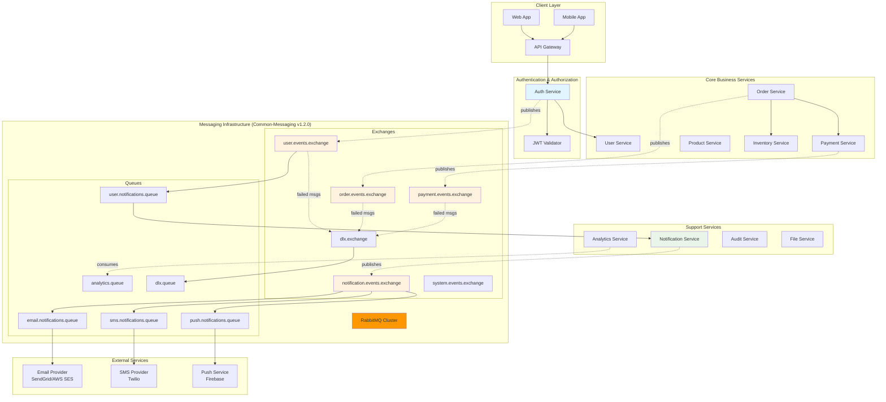

### **2. Message Flow State Diagram**

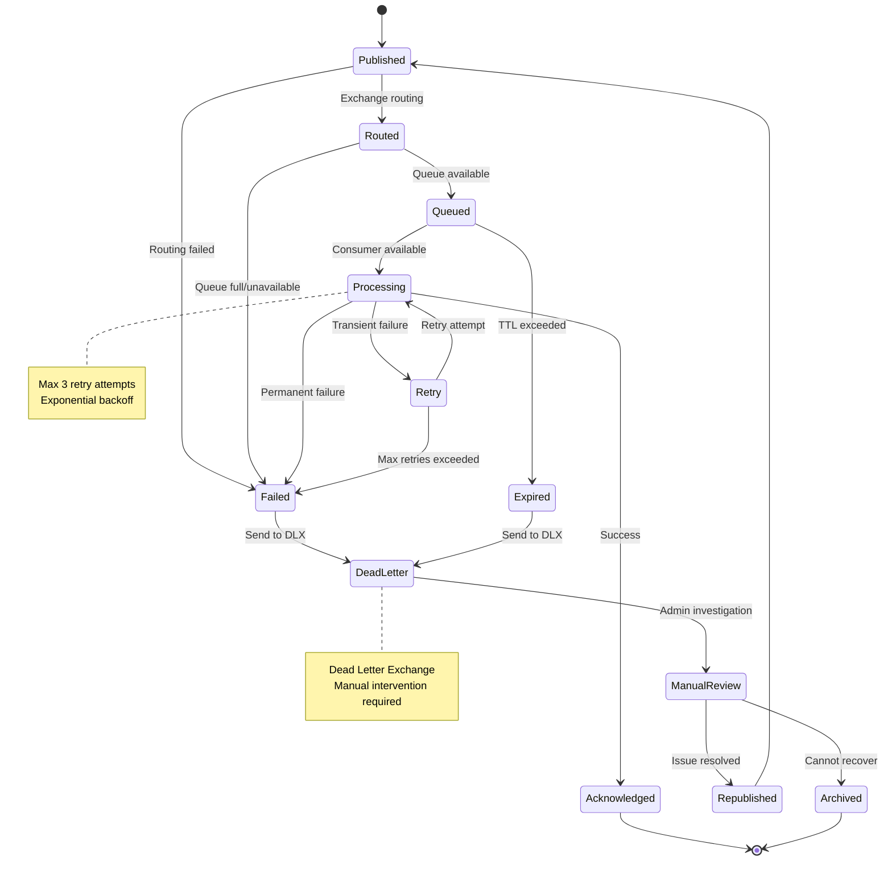

### **3. User Registration Complete Flow**

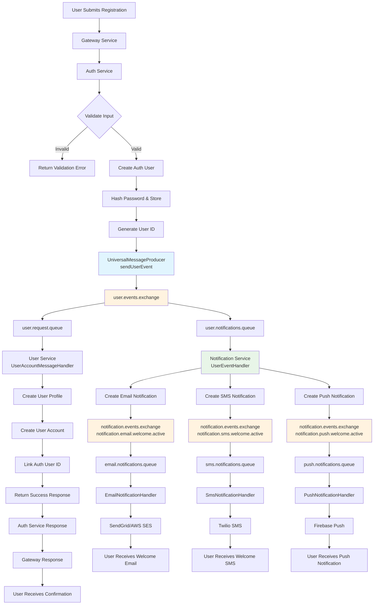

---

## 🔄 **Component Interaction Diagrams**

### **4. UniversalMessageProducer Internal Flow**

```mermaid
flowchart TD
    A[Service Method Call] --> B[UniversalMessageProducer]
    
    B --> C{Message Type Check}
    C -->|User Event| D[sendUserEvent()]
    C -->|Notification| E[sendNotification()]
    C -->|Order Event| F[sendOrderEvent()]
    C -->|Custom| G[sendMessage()]
    
    D --> H[RoutingKeyBuilder.buildUserEvent()]
    E --> I[RoutingKeyBuilder.buildNotificationEvent()]
    F --> J[RoutingKeyBuilder.buildOrderEvent()]
    G --> K[RoutingKeyBuilder.build()]
    
    H --> L[Add Headers<br/>- messageId<br/>- timestamp<br/>- priority<br/>- retryCount]
    I --> L
    J --> L
    K --> L
    
    L --> M{Priority Check}
    M -->|EMERGENCY| N[Immediate Processing]
    M -->|CRITICAL| O[High Priority Queue]
    M -->|NORMAL| P[Standard Processing]
    M -->|LOW| Q[Batch Processing]
    
    N --> R[RabbitTemplate.convertAndSend()]
    O --> R
    P --> R
    Q --> R
    
    R --> S{Confirm Callback}
    S -->|ACK| T[Message Delivered Successfully]
    S -->|NACK| U[Delivery Failed]
    
    U --> V[Log Error & Trigger Retry]
    V --> W[Exponential Backoff]
    W --> R
    
    T --> X[Update Metrics]
    X --> Y[Return Success]
    
    style B fill:#e1f5fe
    style H fill:#fff3e0
    style I fill:#fff3e0
    style J fill:#fff3e0
    style K fill:#fff3e0
    style R fill:#ffecb3
```

### **5. RabbitMQ Queue Binding Strategy**

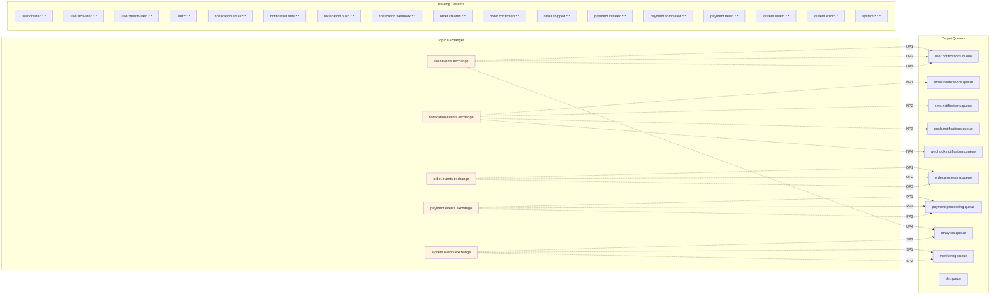

---

## 📊 **Performance & Monitoring Diagrams**

### **6. Message Processing Performance Flow**

```mermaid
gantt
    title Message Processing Timeline
    dateFormat X
    axisFormat %L ms
    
    section Message Journey
    Published to Exchange     :0, 5
    Routed to Queue          :5, 10
    Queue Wait Time          :10, 50
    Consumer Processing      :50, 200
    Business Logic           :200, 800
    Response Generation      :800, 850
    Acknowledgment           :850, 860
    
    section Error Scenarios
    Retry Attempt 1         :milestone, 1000
    Retry Attempt 2         :milestone, 2000
    Retry Attempt 3         :milestone, 4000
    Dead Letter Queue       :milestone, 8000
    
    section Priority Levels
    Emergency Processing    :crit, 0, 100
    Critical Processing     :active, 0, 200
    Normal Processing       :done, 0, 500
    Low Priority Batch      :0, 2000
```

### **7. System Health Monitoring Dashboard**

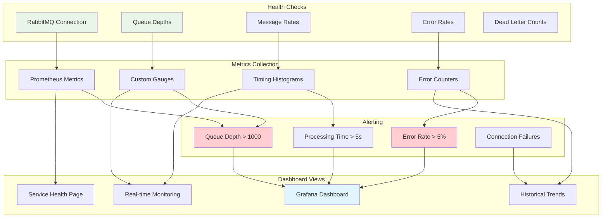

---

## 🚀 **Deployment Architecture Diagrams**

### **8. Kubernetes Deployment Strategy**

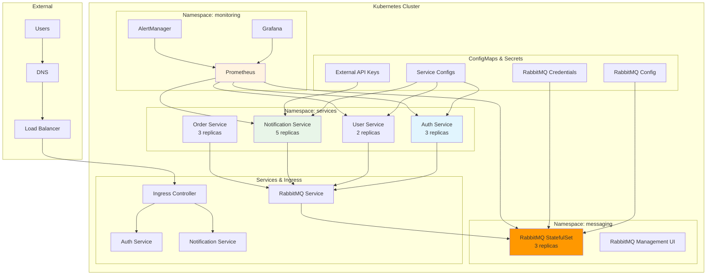

### **9. Docker Compose Development Setup**

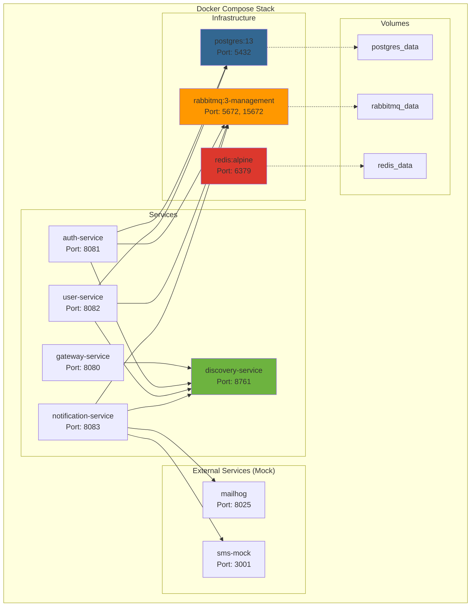

---

## 🔍 **Troubleshooting Flowcharts**

### **10. Message Not Delivered Troubleshooting**

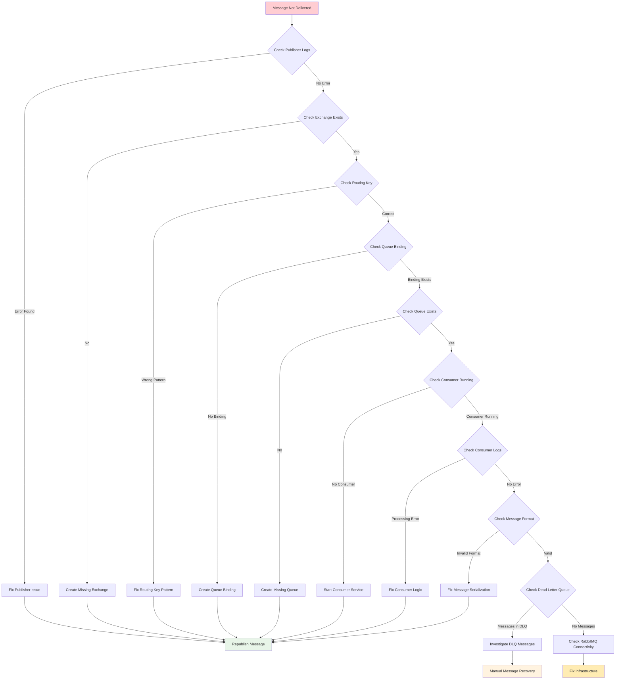

### **11. Performance Issues Diagnostic**

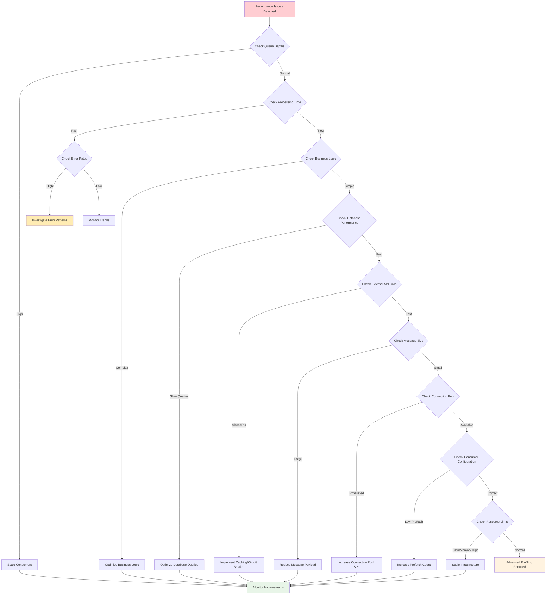

---

## 📈 **Capacity Planning Diagrams**

### **12. Load Testing Scenarios**

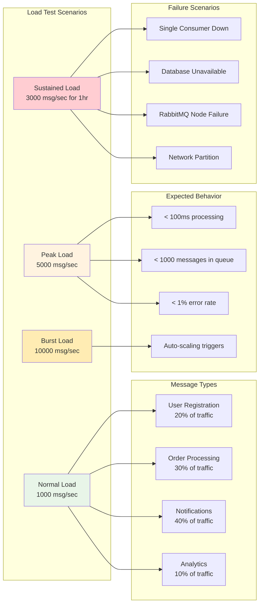

### **13. Scaling Strategy Decision Tree**

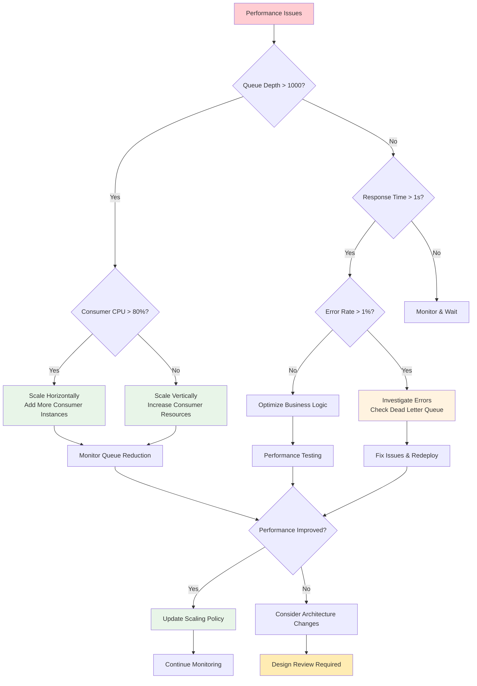

---

## 🔐 **Security & Compliance Diagrams**

### **14. Message Security Flow**

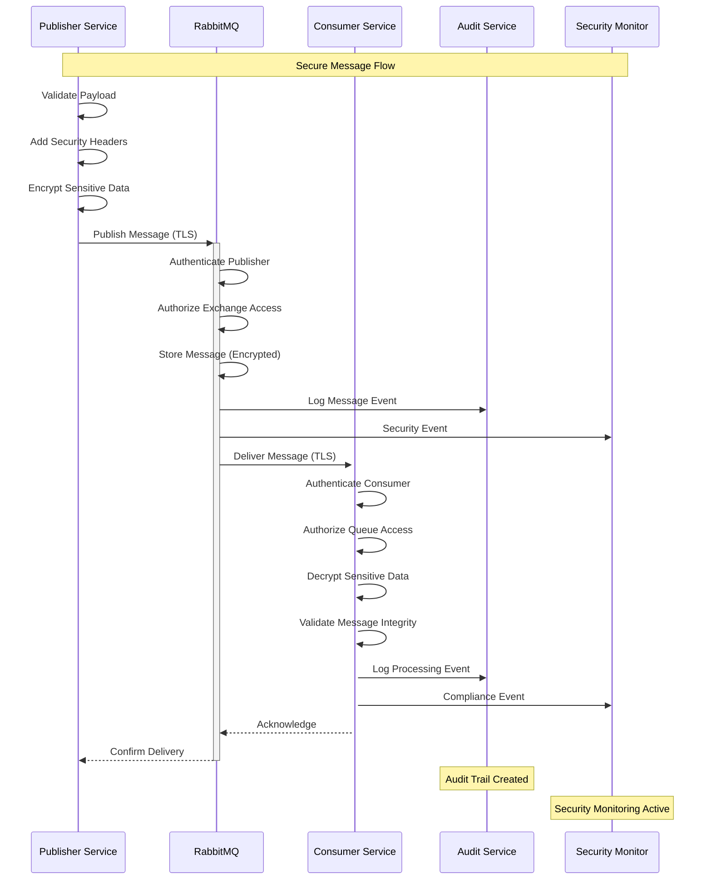

### **15. Compliance & Audit Trail**

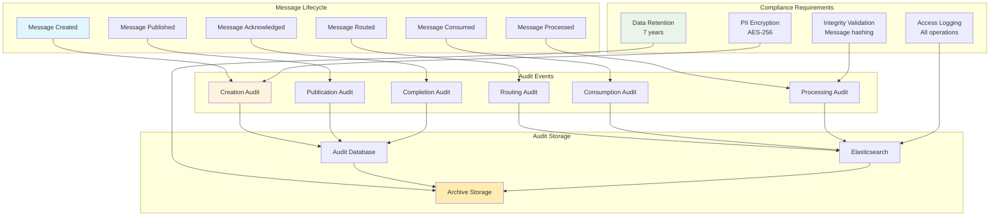

---

## 📊 **Version Comparison Chart**

### **16. Feature Evolution: v1.0.0 → v1.2.0**

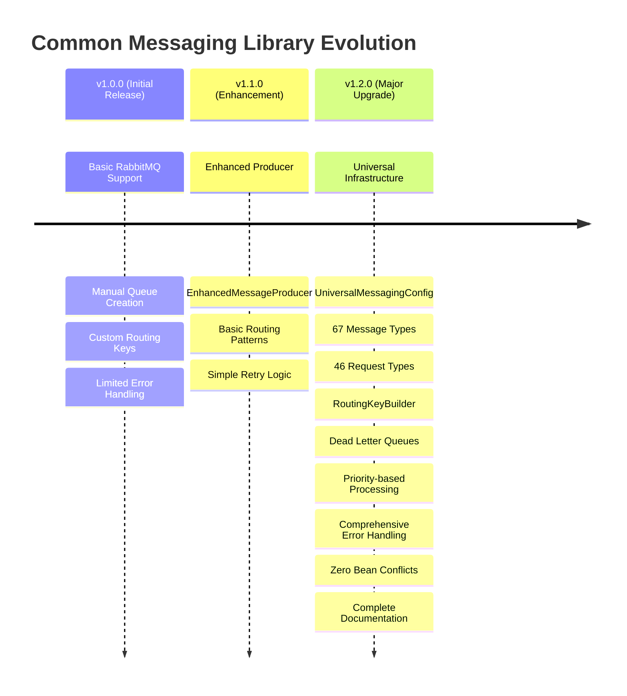

---

## 🎯 **Quick Reference Diagrams**

### **17. Routing Key Pattern Reference**

```mermaid
block-beta
    columns 4
    
    block:Entity
        User["user"]
        Order["order"]
        Payment["payment"]
        Notification["notification"]
        System["system"]
        Analytics["analytics"]
    end
    
    block:Action
        Created["created"]
        Updated["updated"]
        Deleted["deleted"]
        Activated["activated"]
        Confirmed["confirmed"]
        Failed["failed"]
    end
    
    block:Status
        Active["active"]
        Inactive["inactive"]
        Pending["pending"]
        Processing["processing"]
        Completed["completed"]
        Error["error"]
    end
    
    block:Service
        Auth["auth"]
        UserSvc["user-service"]
        OrderSvc["order-service"]
        NotifSvc["notification"]
        Gateway["gateway"]
        Analytics["analytics"]
    end
    
    Entity --> Action
    Action --> Status
    Status --> Service
    
    classDef entity fill:#e1f5fe
    classDef action fill:#fff3e0
    classDef status fill:#e8f5e8
    classDef service fill:#ffecb3
    
    class User,Order,Payment,Notification,System,Analytics entity
    class Created,Updated,Deleted,Activated,Confirmed,Failed action
    class Active,Inactive,Pending,Processing,Completed,Error status
    class Auth,UserSvc,OrderSvc,NotifSvc,Gateway,Analytics service
```

### **18. Message Priority Processing**

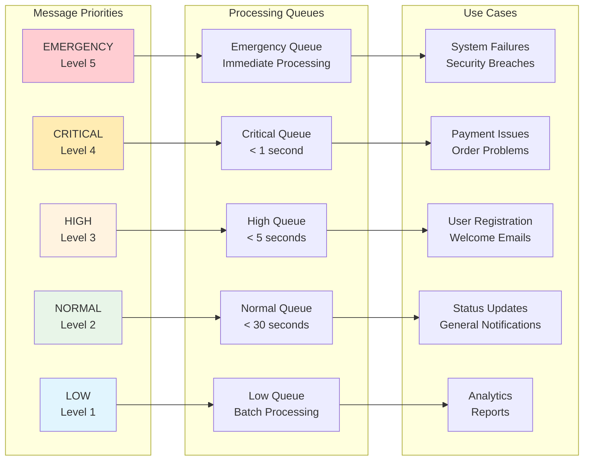

---

## 📝 **Summary**

This comprehensive visual documentation provides detailed diagrams for:

- ✅ **System Architecture** - Complete messaging infrastructure overview
- ✅ **Message Flows** - Step-by-step process diagrams
- ✅ **Component Interactions** - Internal library workflows
- ✅ **Performance Monitoring** - Metrics and health checks
- ✅ **Deployment Strategies** - Kubernetes and Docker Compose
- ✅ **Troubleshooting Guides** - Problem resolution flowcharts
- ✅ **Security & Compliance** - Audit trails and security flows
- ✅ **Quick References** - Routing patterns and priorities

These diagrams complement the main documentation and provide visual guidance for implementing, maintaining, and troubleshooting the Common Messaging Library v1.2.0 in production environments.

**Last Updated**: November 2, 2025  
**Version**: 1.2.0  
**Status**: Production Ready ✅
