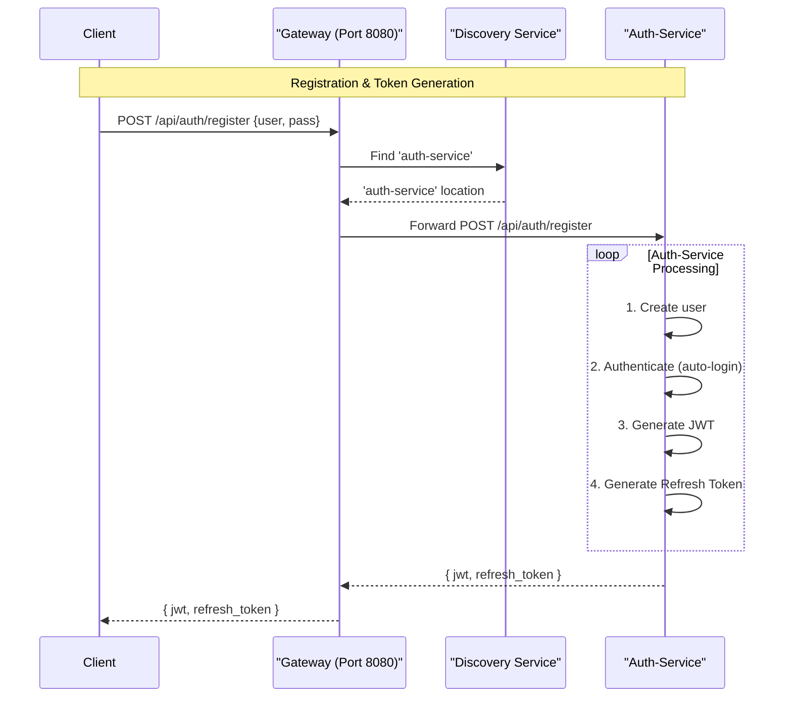
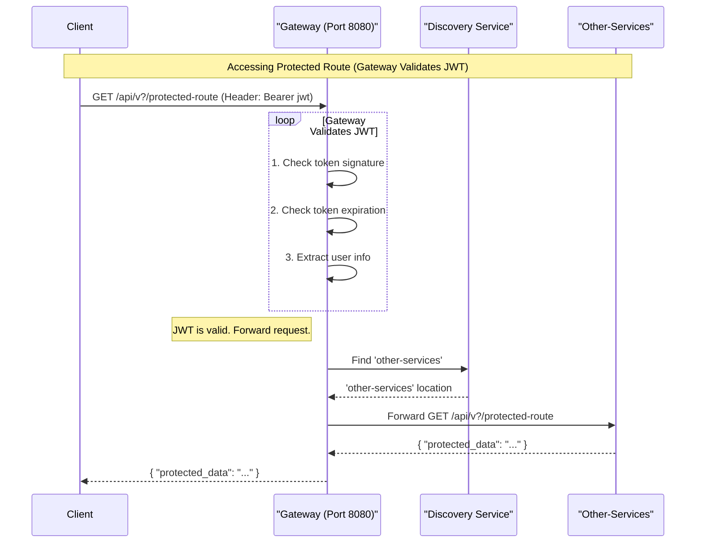

# AUTH SERVICE 

The `auth service` is a Spring Boot application that provides authentication and authorization functionalities for the Yaaniq platform. It leverages various Spring technologies to ensure secure and efficient user management.

## Version && Dependencies

- **Version**: 1.0.0
- **Java**: 17
- **Group ID**: com.yaaniq
- **Artifact ID**: auth-service
- **Packaging**: Jar
- **Spring Boot Version**: 3.5.5
- **Spring Cloud Version**: 2025.0.1

---

### Key Dependencies
- Spring Web
- Spring Boot DevTools
- Spring Boot Actuator
- Spring Data JPA
- Spring Security
- Eureka Server
- OpenFeign
- Config Client
- OAuth2 Authorization Server

---

## Features
- RESTful Web Services
- User Authentication and Authorization
- Data Validation
- Integration with JPA for Database Operations
- Service Discovery with Eureka
- Declarative REST calls with OpenFeign
- OAuth2 Authorization Server capabilities

---

## Tech Diagrams

### 1. User Registration & Token Generation

---

### 2. Token Validation 

---